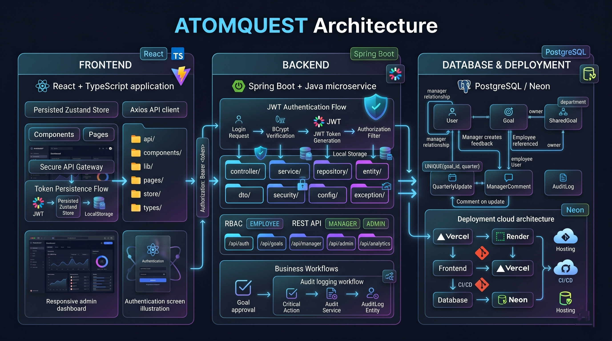

# ATOMQUEST Goal Tracking Portal

Hackathon-ready enterprise goal setting and quarterly performance tracking portal.

## 🏗️ Architecture Diagram

<p align="center">
  
</p>

## Architecture

- `frontend/`: React + Vite + TypeScript + Tailwind CSS + shadcn-style components + Zustand + React Hook Form + Zod + Recharts.
- `backend/`: Spring Boot + Spring Security + JWT + Spring Data JPA + Hibernate + Lombok + Maven.
- `database`: PostgreSQL locally, Neon PostgreSQL for deployment.

## Roles And Demo Logins

All demo passwords are `123456`.

| Role | Email |
| --- | --- |
| Employee | `employee@demo.com` |
| Manager | `manager@demo.com` |
| Admin / HR | `admin@demo.com` |

## Run Locally

Create a PostgreSQL database named `atomquest`, then run:

```bash
cd backend
mvn spring-boot:run
```

In another terminal:

```bash
cd frontend
npm install
npm run dev
```

Frontend: `http://localhost:5173`
Backend: `http://localhost:8080`

## Environment

Backend:

```env
DATABASE_URL=jdbc:postgresql://localhost:5432/atomquest
DATABASE_USERNAME=postgres
DATABASE_PASSWORD=postgres
JWT_SECRET=replace-with-a-long-secret-for-render
CORS_ALLOWED_ORIGINS=http://localhost:5173,https://your-app.vercel.app
```

Frontend:

```env
VITE_API_URL=https://your-render-service.onrender.com/api
```

## Core Business Rules

- Maximum 8 goals per employee.
- Minimum goal weightage is 10%.
- Goal sheet submission requires total weightage to equal 100%.
- Approved goals are locked.
- Admin can unlock locked goals.
- Shared goal title and target are read-only for employees.
- Quarterly updates are allowed in the active check-in period.

## Deployment

1. Create a Neon PostgreSQL database and copy its JDBC URL, username, and password.
2. Deploy `backend/` to Render as a Java Maven service.
3. Set Render environment variables from the backend environment block above.
4. Deploy `frontend/` to Vercel.
5. Set `VITE_API_URL` to the Render backend `/api` URL.
6. Set `CORS_ALLOWED_ORIGINS` on Render to the Vercel URL.

## Hackathon Demo Flow

1. Login as employee and create goals.
2. Submit the goal sheet after the total weightage reaches 100%.
3. Login as manager and approve/reject submitted goals.
4. Login as employee and add quarterly updates.
5. Login as admin to unlock goals, manage users, export CSV, and view audit logs.
6. Show analytics charts and Smart Insights for the enterprise feel.
